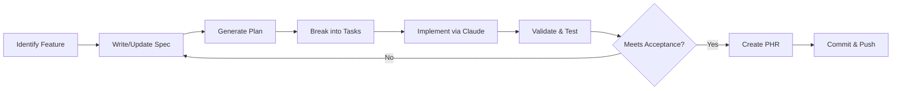

<!--
Sync Impact Report:
Version: 1.0.0 (Initial constitution ratification)
Modified Principles: N/A (first version)
Added Sections: All core sections established
Removed Sections: N/A
Templates Status:
  ✅ plan-template.md - aligned with constitution principles
  ✅ spec-template.md - aligned with constitution requirements
  ✅ tasks-template.md - aligned with task structure
Follow-up TODOs: None
-->

# Hackathon II: The Evolution of Todo - Constitution

**Project Title**: Hackathon II: The Evolution of Todo – Mastering Spec-Driven Development & Cloud Native AI

**Vision**: To master the architecture of intelligence by progressively evolving a Todo application from a simple CLI console app to a fully distributed, event-driven, cloud-native AI-powered system—entirely through spec-driven development where AI agents generate all implementation code.

**Philosophy**: Participants act as Product Architects who orchestrate intelligence rather than write syntax. Engineers shift from "syntax writers" to "system architects" who design, specify, and validate while AI agents execute.

---

## Core Principles

### I. Spec-Driven Development (SDD) Mandate - NON-NEGOTIABLE

**All code MUST be generated by Claude Code from refined specifications. Manual coding is strictly prohibited.**

Rules:
- Every feature MUST flow through: Constitution → Specify (WHAT) → Plan (HOW) → Tasks (BREAKDOWN) → Implement (CODE)
- No code shall be written without a corresponding specification, architectural plan, and atomic task definition
- Specifications MUST be refined iteratively until Claude Code generates correct, complete, and production-ready output
- Every code file MUST contain comments linking it to specific Task IDs and Spec sections
- If an agent cannot find the required spec, it MUST stop and request clarification—never improvise

**Rationale**: Ensures systematic development, prevents "vibe coding," maintains complete traceability from requirements to implementation, and creates a reusable knowledge base for AI-native development patterns.

---

### II. Agentic Dev Stack Workflow - STRICTLY ENFORCED

**Development MUST follow the exact workflow sequence without deviation.**

Workflow Phases (in order):
1. **Specify** → Document WHAT to build (requirements, user journeys, acceptance criteria)
2. **Plan** → Document HOW to build (architecture, components, APIs, data models)
3. **Tasks** → Document STEPS to build (atomic, testable, independently verifiable units)
4. **Implement** → Generate code via Claude Code from task specifications
5. **Validate** → Ensure spec compliance and acceptance criteria fulfillment

**Spec-Kit Plus Integration**:
- Use `/sp.constitution` for creating/updating this constitution
- Use `/sp.specify` for requirements documentation
- Use `/sp.plan` for architectural planning
- Use `/sp.tasks` for task breakdown
- Use `/sp.implement` for code generation orchestration

**Rationale**: Provides predictable, repeatable process that enables AI agents to work autonomously while maintaining quality and alignment with requirements.

---

### III. Phase-Based Evolution - INCREMENTAL TRANSFORMATION

**The project MUST evolve through 5 distinct phases, each building upon the previous.**

Phase Structure:
- **Phase I (100 pts)**: In-Memory Python Console App - Basic CRUD operations
- **Phase II (150 pts)**: Full-Stack Web Application - Next.js frontend, FastAPI backend, Neon PostgreSQL
- **Phase III (200 pts)**: AI-Powered Chatbot - OpenAI ChatKit, Agents SDK, MCP tools
- **Phase IV (250 pts)**: Local Kubernetes Deployment - Docker, Minikube, Helm charts
- **Phase V (300 pts)**: Cloud-Native Event-Driven - Kafka, Dapr, DigitalOcean Kubernetes

Phase Constraints:
- Each phase MUST be independently runnable and demonstrable
- Phases organized in separate directories: `phase1-console/`, `phase2-fullstack/`, etc.
- Git tags MUST mark each phase completion: `v1.0-phase1`, `v2.0-phase2`, etc.
- Each phase MUST have its own specifications in `specs/phase-N/`
- Constitution evolves but remains singular across all phases

**Rationale**: Simulates real-world software evolution, enables independent evaluation of each phase, and demonstrates progressive mastery of increasingly complex architectural patterns.

---

### IV. Technology Stack Constraints - PHASE-SPECIFIC IMMUTABILITY

**Once a phase's technology stack is defined, it MUST NOT be changed within that phase.**

#### Phase I Stack (IMMUTABLE within Phase I):
```yaml
Language: Python 3.13+
Package Manager: UV
Storage: In-memory only (list/dict data structures)
Interface: Command-line interface (CLI)
Testing: pytest
Code Generation: Claude Code
Specification Management: Spec-Kit Plus
```

#### Phase II Stack Additions:
```yaml
Frontend: Next.js 16+ (App Router), TypeScript, Tailwind CSS
Backend: Python FastAPI, SQLModel (ORM)
Database: Neon Serverless PostgreSQL
Authentication: Better Auth with JWT
Deployment: Vercel (frontend), Railway/Render (backend)
Containerization: Docker, docker-compose
```

#### Phase III Stack Additions:
```yaml
AI Framework: OpenAI Agents SDK
Chatbot UI: OpenAI ChatKit
MCP Server: Official MCP SDK (Python)
Natural Language: OpenAI GPT-4
State Management: Database-backed (stateless server)
```

#### Phase IV Stack Additions:
```yaml
Containerization: Docker Desktop, Gordon (Docker AI)
Orchestration: Kubernetes (Minikube local)
Package Manager: Helm Charts
AI DevOps: kubectl-ai, kagent
Infrastructure as Code: Kubernetes YAML manifests
```

#### Phase V Stack Additions:
```yaml
Event Streaming: Kafka (Strimzi operator) or Redpanda Cloud
Distributed Runtime: Dapr (Pub/Sub, State, Bindings, Secrets, Service Invocation)
Cloud Platform: DigitalOcean Kubernetes, Azure AKS, or Google Cloud GKE
CI/CD: GitHub Actions
Monitoring: Kubernetes-native observability
```

**Rationale**: Ensures technology decisions are deliberate and phase-appropriate, prevents scope creep, and maintains consistency within each evolutionary stage.

---

### V. Feature Progression Discipline - STRUCTURED COMPLEXITY GROWTH

**Features MUST be implemented in defined tiers: Basic → Intermediate → Advanced.**

#### Basic Level (Core Essentials) - MUST HAVE in Phase I:
1. **Add Task** - Create new todo items with title and description
2. **Delete Task** - Remove tasks by unique ID
3. **Update Task** - Modify existing task title and description
4. **View Task List** - Display all tasks with status indicators
5. **Mark as Complete** - Toggle task completion status (boolean)

#### Intermediate Level (Organization & Usability) - Phase II onwards:
1. **Priorities & Tags/Categories** - Assign levels (high/medium/low) and labels (work/home/personal)
2. **Search & Filter** - Keyword search and filtering by status, priority, category, or date
3. **Sort Tasks** - Reorder by due date, priority, creation date, or alphabetically

#### Advanced Level (Intelligent Features) - Phase III onwards:
1. **Recurring Tasks** - Auto-reschedule repeating tasks (e.g., "weekly team meeting")
2. **Due Dates & Time Reminders** - Set deadlines with date/time pickers and browser/system notifications

Acceptance Criteria Template (per feature):
- Clear user feedback for all operations
- Proper error handling with informative messages
- Input validation at system boundaries
- Unit tests with minimum 80% code coverage
- Integration tests for end-to-end workflows

**Rationale**: Ensures foundational features work correctly before adding complexity, enables progressive learning, and provides clear evaluation criteria for each phase.

---

### VI. Code Quality & Architecture Standards - NON-NEGOTIABLE

**All generated code MUST meet production-grade quality standards.**

#### Python Code Standards (Phases I-V backend):
```python
# Style Guide: PEP 8 compliance (enforced via ruff or black)
# Type Hints: Required for all function signatures and class attributes
# Docstrings: Required for all public functions, classes, and modules (Google style)
# Error Handling: Explicit error messages, no silent failures, proper exception hierarchy
# Naming Conventions:
#   - snake_case for functions, variables, module names
#   - PascalCase for classes
#   - UPPER_CASE for constants
# Async/Await: Use for I/O-bound operations (database, API calls, file operations)
```

#### TypeScript/JavaScript Standards (Phase II onwards):
```typescript
// Style Guide: ESLint + Prettier configuration
// Type Safety: Strict TypeScript mode enabled
// Component Structure: Functional components with hooks (React)
// State Management: React hooks (useState, useEffect) or Context API
// API Client: Centralized in /lib/api.ts with error handling
// Styling: Tailwind CSS utility classes (no inline styles)
```

#### Project Structure Standards:
- Single Responsibility Principle: Each module/component has one clear purpose
- Dependency Injection: Pass dependencies explicitly, avoid global state
- Clean Architecture: Separate business logic from infrastructure concerns
- DRY (Don't Repeat Yourself): Extract reusable utilities and components
- YAGNI (You Aren't Gonna Need It): Implement only specified features

#### Testing Standards:
- **Unit Tests**: All business logic functions and pure utility functions
- **Integration Tests**: API endpoints, database operations, service interactions
- **E2E Tests** (Phase II onwards): Critical user workflows end-to-end
- **Minimum Coverage**: 80% code coverage across all phases
- **Test Naming**: `test_<feature>_<scenario>_<expected_outcome>()`

**Rationale**: Ensures maintainability, readability, and professional-grade code quality that demonstrates mastery of software engineering principles alongside AI-assisted development.

---

### VII. Security & Safety Discipline - DEFENSE IN DEPTH

**Security MUST be designed into specifications, not added as afterthought.**

#### Phase-Specific Security Requirements:

**Phase I Security:**
- Input validation for all user inputs (length limits, character restrictions)
- No code execution from user input (no eval, exec, or similar constructs)
- Clear error messages without exposing internal implementation details
- No external network calls or file system access (pure in-memory operations)

**Phase II Security:**
- JWT-based authentication with Better Auth
- User isolation: Each user accesses only their own tasks
- SQL injection prevention via SQLModel parameterized queries
- CORS configuration for frontend-backend communication
- Environment variable management for sensitive credentials (.env files)
- HTTPS enforcement in production deployments

**Phase III Security:**
- API key management via secure secret stores
- Rate limiting on API endpoints
- Input sanitization for AI chatbot interactions
- No prompt injection vulnerabilities in AI agent interactions
- MCP tool authorization and validation

**Phase IV-V Security:**
- Kubernetes Secrets for sensitive data management
- RBAC (Role-Based Access Control) in Kubernetes
- Network policies for pod-to-pod communication
- Container image scanning for vulnerabilities
- Dapr secrets management integration

**Rationale**: Security vulnerabilities are expensive to fix post-deployment. Spec-driven security ensures threats are addressed during design phase.

---

### VIII. Documentation Excellence - KNOWLEDGE PRESERVATION

**Every phase MUST include comprehensive, accessible documentation.**

#### Required Documentation Per Phase:

1. **README.md** (Phase-specific):
   - Project description and current phase objectives
   - Installation and setup instructions (step-by-step)
   - Usage examples for all implemented features
   - Technology stack explanation
   - Development workflow overview
   - Known issues and limitations

2. **CLAUDE.md** (Root-level):
   - Agent instructions referencing this constitution
   - Project navigation guidelines
   - Spec-driven workflow integration
   - Custom skills and subagents documentation

3. **specs/** (Phase-specific subdirectories):
   - `spec.md`: Requirements, user journeys, acceptance criteria
   - `plan.md`: Architecture, component diagrams, API contracts
   - `tasks.md`: Atomic task breakdown with test cases

4. **history/prompts/** (Prompt History Records):
   - Every significant user-agent interaction documented
   - Organized by phase subdirectories
   - Captures specification refinement iterations
   - Demonstrates spec-driven development process

5. **history/adr/** (Architectural Decision Records):
   - Documents significant architectural choices
   - Rationale, alternatives considered, trade-offs
   - Created when prompted during planning or task generation

**Documentation Standards:**
- Use clear, concise language (avoid jargon without explanation)
- Include code examples with explanatory comments
- Provide both "quick start" and "comprehensive guide" sections
- Keep documentation synchronized with implementation
- Use diagrams where helpful (ASCII art acceptable)

**Rationale**: Documentation serves as knowledge base for future phases, enables evaluation of thought process, and demonstrates professional development practices.

---

### IX. Submission & Presentation Standards - JUDGE-READY DELIVERABLES

**Each phase submission MUST meet specific deliverable requirements.**

#### Required Submissions Per Phase:

1. **Public GitHub Repository**:
   - All source code for completed phase
   - Complete specification artifacts in `specs/phase-N/`
   - This constitution file (updated if principles evolved)
   - Comprehensive README.md per phase
   - Clear commit history showing development progression
   - Git tags marking phase completion

2. **Deployed Application Links**:
   - Phase I: Not applicable (local console app)
   - Phase II: Vercel frontend URL + Backend API URL
   - Phase III-V: Chatbot interface URL
   - Phase IV: Minikube setup instructions (local deployment)
   - Phase V: Cloud deployment URL (DigitalOcean DOKS or equivalent)

3. **Demo Video** (MANDATORY, max 90 seconds):
   - Must demonstrate ALL implemented features for the phase
   - Must show spec-driven development workflow
   - Clear narration or on-screen text explaining each feature
   - **Judges will ONLY watch first 90 seconds** - structure accordingly
   - Can use NotebookLM for AI-generated narration or manual recording

4. **WhatsApp Number**:
   - For presentation invitation (top submissions only)
   - Zoom presentation opportunity on specified Sundays

#### Submission Checklist Template:
```markdown
## Phase [N] Submission Checklist

- [ ] GitHub repository URL submitted
- [ ] All features from spec implemented and testable
- [ ] README.md comprehensive and accurate
- [ ] specs/phase-N/ complete (spec.md, plan.md, tasks.md)
- [ ] Demo video created (< 90 seconds)
- [ ] Deployed application accessible (if applicable)
- [ ] Git tagged: v[N].0-phase[N]
- [ ] No manual coding evidence (all code AI-generated)
- [ ] Constitution updated if principles evolved
```

**Rationale**: Clear submission standards ensure fair evaluation, demonstrate professionalism, and create shareable portfolio artifacts.

---

### X. Reusable Intelligence Patterns - BONUS MASTERY

**Advanced participants MAY create reusable agent skills and subagents for bonus points.**

#### Reusable Intelligence Categories:

1. **Claude Code Agent Skills** (+200 bonus points):
   - Custom `/` commands for repetitive workflows
   - Example: `/hackathon.phase-setup`, `/hackathon.mcp-tools`, `/hackathon.k8s-deploy`
   - Stored in `.claude/commands/` directory
   - Must include clear documentation and usage examples

2. **Cloud-Native Blueprints** (+200 bonus points):
   - Reusable deployment templates via Agent Skills
   - Kubernetes manifest generators
   - Dapr component configuration templates
   - Helm chart scaffolding automation

3. **Specialized Subagents**:
   - Purpose-built agents for specific tasks (e.g., K8s deployment, MCP tool generation)
   - Documented in project with clear invocation patterns
   - Demonstrates understanding of agent orchestration

**Skill Design Principles:**
- Single, well-defined purpose per skill
- Clear input/output contracts
- Comprehensive documentation
- Reusable across similar projects
- Demonstrates deep understanding of spec-driven patterns

**Rationale**: Encourages participants to think beyond single-project implementation toward creating reusable AI-native development infrastructure.

---

## Technology Selection Rationale

### Why These Technologies?

**Python**: Widely adopted, excellent AI/ML ecosystem, clean syntax for code generation

**Next.js**: Modern React framework, excellent developer experience, built-in optimizations

**FastAPI**: Python's fastest API framework, automatic OpenAPI docs, async support

**SQLModel**: Type-safe ORM combining SQLAlchemy + Pydantic, perfect for FastAPI

**Neon PostgreSQL**: Serverless, generous free tier, instant scaling

**OpenAI Agents SDK**: Official framework for building stateful AI agents

**MCP (Model Context Protocol)**: Standard protocol for AI-tool integration

**Kubernetes**: Industry-standard container orchestration, real-world relevance

**Dapr**: Simplifies microservices with portable building blocks

**Kafka**: De facto event streaming platform for distributed systems

---

## Development Workflow (Detailed)

### Daily Development Cycle:



### Spec Refinement Loop:
1. Write initial specification based on requirements
2. Use Claude Code to attempt implementation
3. If output incorrect/incomplete, refine specification
4. Repeat steps 2-3 until Claude generates correct code
5. Document iteration count in Prompt History Record

### Task Structure (MANDATORY Format):

```markdown
## Task ID: T-XXX
**From**: spec.md §X.X, plan.md §Y.Y
**Description**: [Clear, actionable description]
**Preconditions**: [What must exist/be true before starting]
**Expected Output**: [Concrete, verifiable deliverable]
**Artifacts**: [Files to create/modify with paths]
**Test Cases**: [How to verify success]
**Acceptance Criteria**: [Checklist of completion requirements]
```

---

## Governance & Amendment Process

### Constitution Authority
- This Constitution supersedes all other practices and guidelines
- When specifications conflict, hierarchy: Constitution > Specify > Plan > Tasks
- All agents (Claude Code, Copilot, Gemini, custom) MUST adhere to this constitution
- Judges evaluate adherence to constitutional principles

### Amendment Procedure
1. **Proposal**: Identify principle requiring change with clear rationale
2. **Documentation**: Update constitution with versioned changes
3. **Impact Assessment**: Identify affected specifications, plans, and tasks
4. **Migration**: Update dependent artifacts to reflect new principles
5. **Approval**: Document amendment in constitution change log
6. **Communication**: Update CLAUDE.md and other agent instructions

### Version Semantics
- **MAJOR** (X.0.0): Backward-incompatible principle removals or redefinitions
- **MINOR** (0.X.0): New principles added or material expansion of existing
- **PATCH** (0.0.X): Clarifications, wording improvements, typo fixes

### Compliance Review
- Every phase transition: Constitution review for necessary updates
- Every specification: Reference to specific constitutional principles
- Every architectural decision: Alignment check with constitution
- Code reviews (if manual review occurs): Constitutional compliance verification

### Conflict Resolution
If conflict arises between constitution and practical implementation:
1. Document the conflict in an ADR (Architectural Decision Record)
2. Propose constitutional amendment OR specification adjustment
3. Never silently violate constitutional principles
4. When in doubt, ask for clarification rather than assume

---

## Change Log

| Date       | Version | Change Summary                                        | Amended By    |
|------------|---------|-------------------------------------------------------|---------------|
| 2025-12-29 | 1.0.0   | Initial constitution ratification for Hackathon II    | Project Setup |

---

## References & Additional Resources

- **Hackathon Document**: Original PDF specification (47 pages)
- **Spec-Kit Plus**: https://github.com/panaversity/spec-kit-plus
- **Claude Code**: https://claude.com/product/claude-code
- **Agentic Dev Stack**: Research materials provided in hackathon documentation
- **Nine Pillars of AI-Driven Development**: Foundational concepts for AI-native engineering

---

**Version**: 1.0.0 | **Ratified**: 2025-12-29 | **Last Amended**: 2025-12-29

---

**Next Actions After Constitution Ratification:**
1. Create Phase I specification using `/sp.specify`
2. Generate architectural plan using `/sp.plan`
3. Break down into tasks using `/sp.tasks`
4. Begin implementation via Claude Code
5. Create Prompt History Record for this constitution creation
