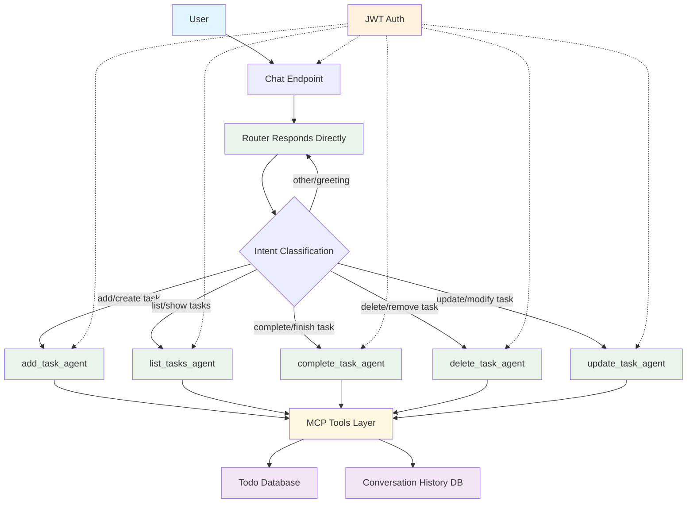

# Phase 3: Todo AI Chatbot Architecture

## Overview

The AI Todo Chatbot is a stateless, multi-agent system that allows users to interact with their todo list using natural language. The system follows a router-handoff pattern where a central Router Agent analyzes user input and delegates tasks to specialized agents for execution.

## Architecture Diagram

## Component Details

### 1. Chat Endpoint
- **Location**: `/api/{user_id}/chat`
- **Function**: Entry point for all user interactions
- **Responsibilities**:
  - Validate JWT authentication
  - Extract user_id from path and verify against authenticated user
  - Load conversation history from database
  - Pass message to Router Agent
  - Store conversation history after processing

### 2. Router Agent
- **Function**: Analyze user intent and route to appropriate specialized agent
- **Responsibilities**:
  - Parse user message and conversation history
  - Classify intent (add, list, complete, delete, update, other)
  - Generate appropriate tool call to specialized agent
  - Handle direct responses for non-task-related messages

### 3. Specialized Agents
Each specialized agent handles a specific type of task:

- **add_task_agent**: Creates new todo items
- **list_tasks_agent**: Retrieves and filters existing todo items
- **complete_task_agent**: Updates task completion status
- **delete_task_agent**: Removes todo items
- **update_task_agent**: Modifies existing todo items

### 4. MCP Tools Layer
- **Function**: Interface between agents and database operations
- **Responsibilities**:
  - Execute database operations for todo management
  - Validate user permissions for each operation
  - Handle transaction management
  - Provide consistent error handling

### 5. Database Layer
- **Components**:
  - Todo table (existing from Phase II)
  - Conversation table (new for Phase III)
  - Message table (new for Phase III)

## Data Flow

1. User sends message to `/api/{user_id}/chat`
2. JWT authentication validates user identity
3. Conversation history is loaded from database
4. Router Agent analyzes message and conversation context
5. Appropriate specialized agent is invoked via tool call
6. MCP Tools execute database operations
7. Response is formatted and returned to user
8. Conversation history is stored in database

## Security Model

- All operations require JWT authentication
- User isolation via user_id validation
- All database operations validated against authenticated user
- Conversation history is isolated by user_id

## Technology Stack

- **AI Framework**: OpenAI Agents SDK
- **Backend**: Python FastAPI
- **MCP Server**: Official MCP SDK
- **Database**: SQLModel + Neon Serverless PostgreSQL
- **Authentication**: Better Auth JWT
- **State Management**: Stateless design with database-backed conversation history